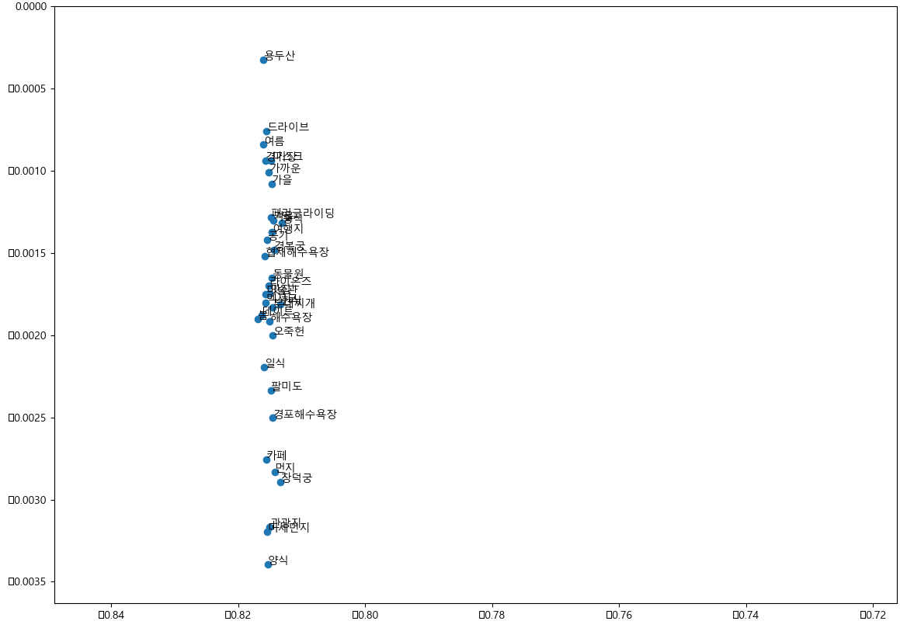

# 자연어처리 여행 정보제공 챗봇 👓

<center>

</center>

딥러닝(케라스)과 자연어처리를 사용해서 대화의 의도파악과 개체명인식, Seq2Seq를 이용한 잡담처리, 이미지 분석을 통한 여행정보를 제공하는 챗봇입니다.
자연어처리를 위한 워드임베딩으로 FastText를 사용하였고, 의도파악과 이미지분석에는 Convolutional neural network, 개체명인식과 Seq2Seq에는 Recurrent Neural Network을 사용하여 구현하였습니다.
<br><br>

##### 단어 벡터 시각화
<center>


</center>
<br><br><br>


##### [시연 동영상]
https://www.youtube.com/watch?v=aikZXcpKetg&feature=youtu.be
<br><br><br>


## 0. 개발환경
```
- Windows10 x64
- Intel i7-8700 CPU @ 3.20GHz
- RAM 32.0GB
- NVIDIA GeForce RTX2080
- Visual Studio Code

- python                3.7.3
- Flask		        1.1.1
- gensim                3.8.1
- numpy                 1.17.3
- konlpy		0.5.1
- JPype1		0.6.3
- nltk		        3.4.4
- Keras		        2.2.4
- keras-contrib	        2.0.8
- redis		        3.3.11
- uuid		        1.30
- PyMySQL		0.9.3
- beautifulsoup4	4.8.0
```
<br>

##### pip install git+https://www.github.com/keras-team/keras-contrib.git
<br><br><br>

## 1. Intent Classification
사용자 대화의 의도를 파악하기 위한 단계
<br>
<br>
konlpy를 사용한 문장 토큰화, Fasttext를 사용한 워드임베딩과 Convolution 네트워크를 사용하여 문장을 분류하였습니다.<br>
의도파악 카테고리 (날씨, 맛집, 미세먼지, 여행지, 관광지)
<center></center>
<br><br>


## 2. Entity Classification
사용자 대화의 의도를 분류 후 대화의 핵심 단어들을 파악하기 위한 단계
<br>
<br>
konlpy를 사용한 문장 토큰화, Fasttext를 사용한 워드임베딩과 BiLSTM-CRF를 사용하여 개체명을 분류하였습니다.<br>
개체명인식 태그(LOCATION, DATE, RESTAURANT, TRAVEL, PURPOSE, O)
<center></center>
<br><br>

#### 의도파악 & 개체명 분류
<center></center>
<br><br>


## 3. Sequence to Sequence
의도파악 카테고리에 해당하지 않는 문장을 처리해주는 단계
<br>
<br>
konlpy를 사용한 문장 토큰화, keras embedding을 사용한 워드임베딩, LSTM(Encoder)-LSTM(Decoder)를 연결하여 Seq2Seq 모델을 구현하였습니다.
<center></center>
<br><br>
<center></center>
<br><br>


## 4. Image Analysis
사용자가 이미지 입력 시 처리하는 단계
<br>
<br>
이미지 256x256 사이즈로 리사이징, Convolution 네트워크를 사용하여 이미지 분석&분류 하였습니다.
<center></center>
<br><br>


## 5. application
```
- 챗봇 로직(의도파악, 개체명인식, fallback, seq2seq, 이미지분석, 시나리오(웹 크롤링))

1. input
2. preprocess (tokenize >> 형태소분석, 불용어 제거)
3-1. get_intent (의도파악)
3-2. get_image  (이미지분석)
4-1. get_entity (개체명 인식)
4-2. get_seq2seq (seq2seq 대화)
5. scenario   (의도, 개체명 >> 크롤링 >> 결과출력)
```
<br><br>


## 6. scenario
```
- 각 의도에 해당하는 웹 크롤링 실행

1. intent 확인 후 맞는 카테고리 메소드 실행
2. 테그 분리 후 크롤링 실행
```


<!--
# 실행방법
```
1. configs 파일 >> root_path 수정
2. configs 파일 >> img_path 디렉토리 생성**
3. /src/models/* 파일  >> root_path 수정
4. /src/util/spell_checker 파일 >> my_dict 수정
5. model/entity/fasttext 모델 다운
5. Flask_restfulAPI.py 실행 (ip수정)
6. 클라이언트에서 질문입력, 결과출력
```
##### Travel_Chatbot/ 경로에 img_upload/input 디렉토리 27개 생성 필요
##### intent/entity 모델, 워드임베딩 file, redis install file 다운로드 ↓
##### https://drive.google.com/drive/folders/1tRVnFlMX1B0W4AqWZznMEa_RQk9QVwaF
<br>
<br>
<br>

# 수정 -- 10/02
```
- application [get_intent(o), get_entity(x), scenario(x)]
- tokenizer
- preprocess
- intent_classification
- configs
- model_configs
- Flask_restfulAPI (main)
```
### flask-restful api
### post로 받아 predict 후 post로 client에 결과전달
<br>
<br>
<br>

# 수정 -- 10/04
```
- application [get_intent(○), get_entity(×), scenario(△)]
- tokenizer
- preprocess
- intent_classification
- configs
- model_configs
- Flask_restfulAPI (main)
- scenario
- crawler_restaurant
- crawler_weather
- crawler_dust
```
##### application 수정
##### crawler 파일 추가
##### scenario 파일 추가
##### config 파일 수정
<br>
<br>
<br>

# 수정 -- 10/07
```
- application [get_intent(○), get_entity(×), scenario(△)]
- tokenizer
- preprocess
- intent_classification
- configs
- model_configs
- crawler_configs
- Flask_restfulAPI (main)
- scenario
- crawler_restaurant
- crawler_weather
- crawler_dust
- crawler_travel
- crawler(seoul_cralwer, busan_cralwer, parsing_test)
```
##### crawler_travel 파일 추가
##### seoul, busan crawler 파일 추가
##### scenario 파일 수정
##### crawler_config 파일 추가
##### Flask_restfulAPI 파일 수정 (post 포맷 변경)
<br>
<br>
<br>

# 수정 -- 10/10
```
- application [get_intent(○), get_entity(○), scenario(△)]
- tokenizer
- preprocess
- intent_classification
- configs
- model_configs
- crawler_configs
- Flask_restfulAPI (main)
- scenario
- crawler_restaurant
- crawler_weather
- crawler_dust
- crawler_travel
- crawler(seoul, busan, incheon, parsing_test, hwaseong, suwon, ganghwa, gyeongju, gangwon, jeju, jeonju)
```
##### crawler_travel 파일 수정
##### hwaseong, suwon, ganghwa, gyeongju, gangwon, jeju, jeonju crawler 파일 추가
##### scenario 파일 수정
##### intent_classification 파일 수정 (fallback 처리)
##### application 파일 수정 (fallback 처리)
<br>
<br>
<br>

# 수정 -- 10/11
```
- application [get_intent(○), get_entity(○), scenario(△)]
- tokenizer
- preprocess
- intent_classification
- configs
- model_configs
- crawler_configs
- Flask_restfulAPI (main)
- scenario
- crawler_restaurant
- crawler_weather
- crawler_dust
- crawler_travel
- crawler(seoul, busan, incheon, parsing_test, hwaseong, suwon, ganghwa, gyeongju, gangwon, jeju, jeonju)
```
##### crawler_travel 파일 수정 (예외처리)
##### crawler_configs 파일 수정 (도시목록 추가)
##### crawler_restaurant 파일 수정 (예외처리)
##### crawler_dust 파일 수정 (크롤링 수정)
##### application 파일 수정 (fallback 처리)
<br>
<br>
<br>

# 수정 -- 10/14
```
- application [get_intent(○), get_entity(○), scenario(△)]
- tokenizer
- preprocess
- intent_classification
- entity_classification
- configs
- model_configs
- crawler_configs
- Flask_restfulAPI (main)
- scenario
- crawler_restaurant
- crawler_weather
- crawler_dust
- crawler_travel
- crawler(seoul, busan, incheon, parsing_test, hwaseong, suwon, ganghwa, gyeongju, gangwon, jeju, jeonju)
```
##### crawler_travel 파일 수정 (check_purpose 함수 수정)
##### crawler_configs 파일 수정 (도시목록 추가)
<br>
<br>
<br>

# 수정 -- 10/15
```
- application [get_intent(○), get_entity(○), scenario(○), get_seq2seq(○)]
- tokenizer
- preprocess
- intent_classification
- entity_classification
- configs
- model_configs
- crawler_configs
- Flask_restfulAPI (main)
- scenario
- crawler_restaurant
- crawler_weather
- crawler_dust
- crawler_travel
- crawler_attraction
- crawler(seoul, busan, incheon, parsing_test, hwaseong, suwon, ganghwa, gyeongju, gangwon, jeju, jeonju, attraction, hanatour, festival)
- seq2seq_translation
- util(constants, response, spell_checker, speel_dict.csv)
```
##### Flask_restfulAPI 파일 수정 (slot 처리)
##### application 파일 수정 (slot 처리, fallback-seq2seq 처리)
##### scenario 파일 수정 (slot 처리, attraction 추가)
##### crawler_* 파일 수정 (에러처리 [try-except])
##### crawler 파일 추가 (attraction, hanatour, festival)
##### crawler_configs 파일 수정 (하나투어 관광지 추가)
##### model_configs 파일 수정 (seq2seq 모델불러오기 추가)
##### seq2seq_translation 파일 추가 (seq2seq[잡담-fallback 처리])
##### util폴더 추가 (토큰화 후 스펠링 체크&수정)
<br>
<br>
<br>

# 수정 -- 10/17
```
- application [get_intent(○), get_entity(○), scenario(○), get_seq2seq(○)]
- tokenizer
- preprocess
- intent_classification
- entity_classification
- configs
- model_configs
- crawler_configs
- Flask_restfulAPI (main)
- scenario
- crawler_restaurant
- crawler_weather
- crawler_dust
- crawler_travel
- crawler_attraction
- crawler(seoul, busan, incheon, parsing_test, hwaseong, suwon, ganghwa, gyeongju, gangwon, jeju, jeonju, attraction, hanatour, festival)
- seq2seq_translation
- util(constants, response, spell_checker, speel_dict.csv)
```
##### Flask_restfulAPI 파일 수정 (slot 처리, welcom class 추가)
##### scenario 파일 수정 (slot 처리)
##### crawler_configs 파일 수정 (여행지 리스트 추가)
##### configs 파일 수정 (welcom 메세지 추가)
##### spell_dict 파일 수정 (오타사전 데이터 추가)
<br>
<br>
<br>

# 수정 -- 10/23
```
- application [get_intent(○), get_entity(○), scenario(○), get_seq2seq(○), get_image(○)]
- tokenizer
- preprocess
- intent_classification
- entity_classification
- configs
- models(EntityModel, IntentModel, ImageModel, Seq2SeqModel)
- crawler_configs
- Flask_restfulAPI (main)
- scenario
- crawler_restaurant
- crawler_weather
- crawler_dust
- crawler_travel
- crawler_attraction
- crawler(seoul, busan, incheon, parsing_test, hwaseong, suwon, ganghwa, gyeongju, gangwon, jeju, jeonju, attraction, hanatour, festival)
- seq2seq_translation
- util(constants, response, spell_checker, speel_dict.csv)
- image_analysis
- model (entity, fasttext, image, seq2seq)
```
##### Flask_restfulAPI 파일 수정 (이미지 분석처리 로직 추가)
##### application 파일 수정 (이미지분석 로직 추가)
##### models 폴더 추가 (서버 실행 시 모델 initializing)
##### image_analysis 추가 (이미지 분석코드 추가)
##### model 폴더 추가 (저장한 모델파일)
<br>
<br>
<br>

# 수정 -- 10/25
```
- application [get_intent(○), get_entity(○), scenario(○), get_seq2seq(○), get_image(○)]
- tokenizer
- preprocess
- intent_classification
- entity_classification
- configs
- models(EntityModel, IntentModel, ImageModel, Seq2SeqModel)
- crawler_configs
- Flask_restfulAPI (main)
- scenario
- crawler_restaurant
- crawler_weather
- crawler_dust
- crawler_travel
- crawler_attraction
- crawler(seoul, busan, incheon, parsing_test, hwaseong, suwon, ganghwa, gyeongju, gangwon, jeju, jeonju, attraction, hanatour, festival)
- seq2seq_translation
- util(constants, response, spell_checker, speel_dict.csv)
- image_analysis
- model (entity, fasttext, image, seq2seq)
```
##### Flask_restfulAPI 파일 수정 (json 리턴 형식 변경)
##### crawler_* 파일 수정 (웹 크로링 시 url정보, 경도, 위도 정보 추출, return 형식 변경)
<br>
<br>
<br>

# 수정 -- 10/31
```
- application [get_intent(○), get_entity(○), scenario(○), get_seq2seq(○), get_image(○)]
- tokenizer
- preprocess
- intent_classification
- entity_classification
- configs
- models(EntityModel, IntentModel, ImageModel, Seq2SeqModel)
- crawler_configs
- Flask_restfulAPI (main)
- scenario
- crawler_restaurant
- crawler_weather
- crawler_dust
- crawler_travel
- crawler_attraction
- crawler(seoul, busan, incheon, parsing_test, hwaseong, suwon, ganghwa, gyeongju, gangwon, jeju, jeonju, attraction, hanatour, festival)
- seq2seq_translation
- util(constants, response, spell_checker, speel_dict.csv, logindb, chatdb, intentdb)
- image_analysis
- model (entity, fasttext, image, seq2seq)
```
##### Flask_restfulAPI 파일 수정 (로그인, 세션 추가)
##### application 파일 수정 (통계데이터 수집 로직 추가)
##### scenario 파일 수정 (통계 및 사용자 채팅로그 수집 로직 추가)
##### util/* 파일 추가 (로그인, 통계, 채팅로그 저장)
<br>
<br>
<br>

# 수정 -- 11/06
```
- application [get_intent(○), get_entity(○), scenario(○), get_seq2seq(○), get_image(○)]
- tokenizer
- preprocess
- intent_classification
- entity_classification
- configs
- models(EntityModel, IntentModel, ImageModel, Seq2SeqModel)
- crawler_configs
- Flask_restfulAPI (main)
- scenario
- crawler_restaurant
- crawler_weather
- crawler_dust
- crawler_travel
- crawler_attraction
- crawler(seoul, busan, incheon, parsing_test, hwaseong, suwon, ganghwa, gyeongju, gangwon, jeju, jeonju, attraction, hanatour, festival)
- seq2seq_translation
- util(constants, response, spell_checker, speel_dict.csv, logindb, chatdb, intentdb)
- image_analysis
- model (entity, fasttext, image, seq2seq)
```
##### Flask_restfulAPI 파일 수정 (사용자 요청 개별처리)
##### Users 파일 추가 (사용자 변수 클래스)
-->